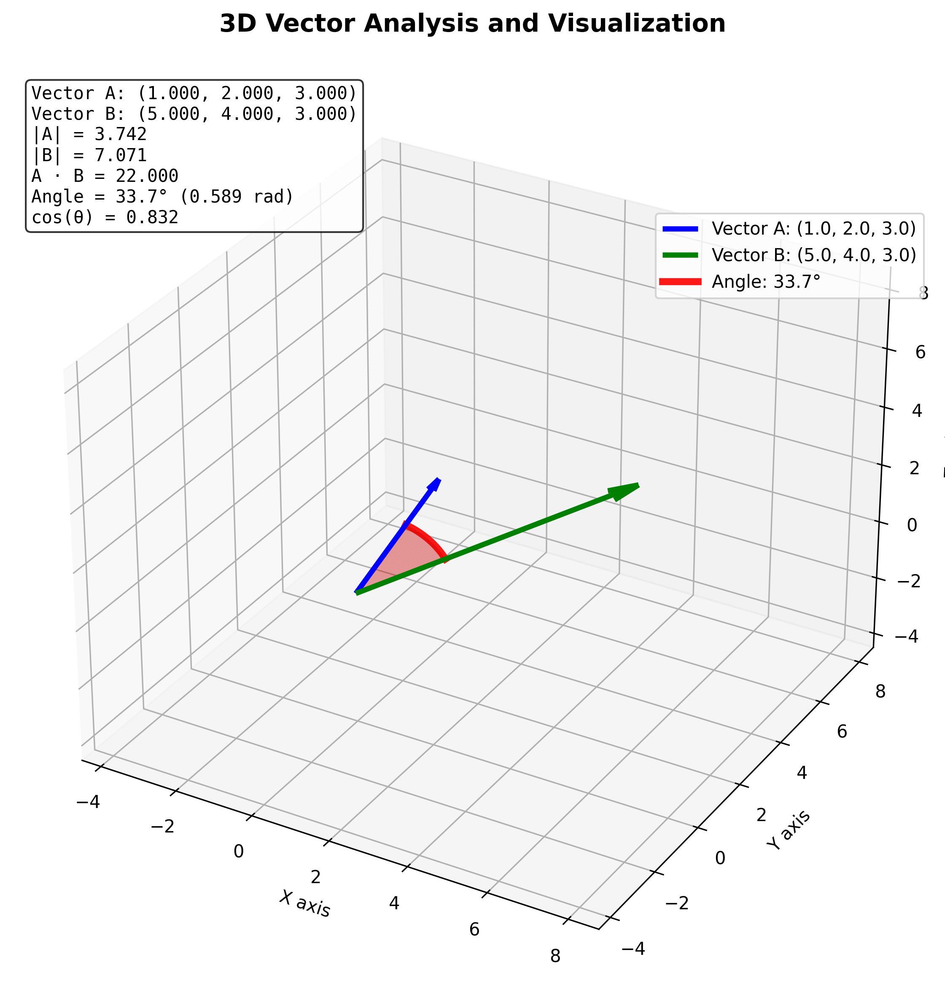

# Vector Operations

This project implements 3D vector operations in C++ with Python visualization.

## Vector Operations

### Dot Product

The dot product formula:
$$|\vec{a}||\vec{b}|\cos\theta = \vec{a}\cdot \vec{b}$$

Vector magnitude:
$$|a| = \sqrt{\sum_i^n a_i^2}$$

### Angle Between Vectors

$$\theta = \arccos\left(\frac{\vec{a}\cdot \vec{b}}{|\vec{a}||\vec{b}|}\right)$$

## Cross-Product

$$\sum_j\sum_k\epsilon_{ijk}\vec{a}_j \vec{b}_k$$

where,
ijk in cyclic: + 1
ijk in anti-cycle: -1
ijk not in cycle: 0

## Visualization

