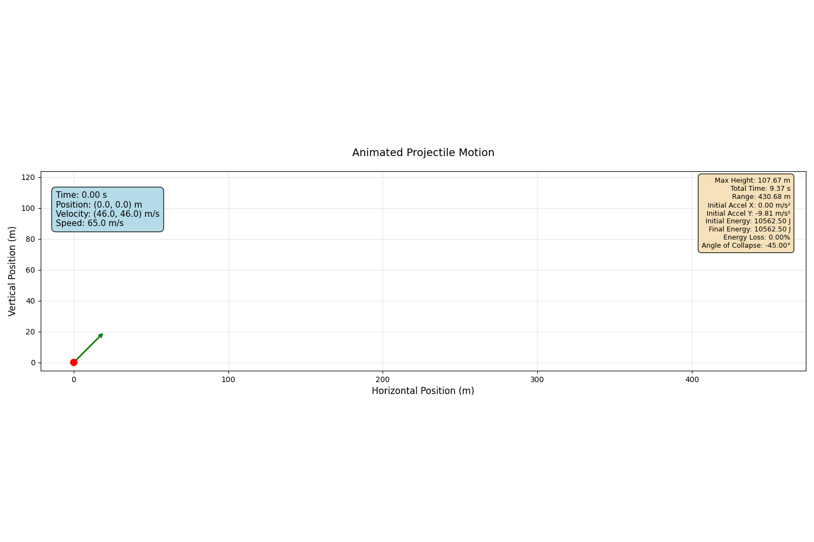
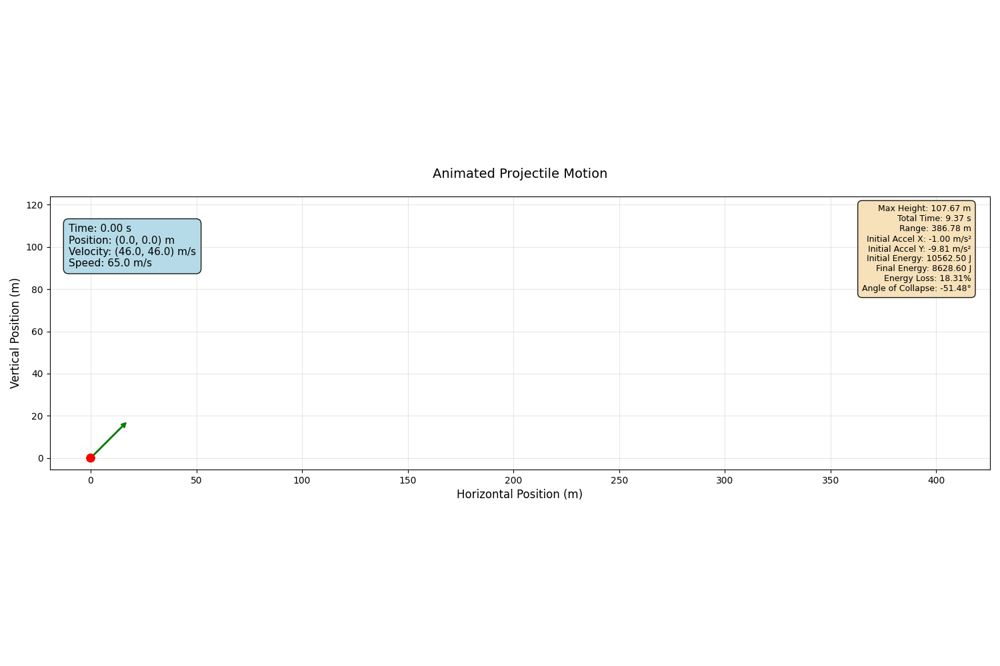

# Projectile Motion

## Integrating Velocity and Position 
Where a is acceleration:

$$v = \int{a}dt = v_0 + at$$
$$S = \int{v}dt = \int{(v_0 + at)}dt = s_0 + v_0t + \frac{1}{2} at^2$$


## Apogee Time

At the apogee, the vertical velocity is zero:

$$\frac{d}{dt}[S_y] = 0$$
$$\frac{d}{dt}[s_{y0} + v_{y0}\tau + \frac{1}{2}a_y\tau^2] = 0$$
$$v_{y0} + a_y\tau = 0$$

Where $a_y = -g$ (gravity), so:

$$\tau = -\frac{v_{y0}}{a_y} = \frac{v_{y0}}{g}$$


## Maximum Height

The maximum height is reached at the apogee time $\tau$:

$$H_{max} = S_y(\tau) = s_{y0} + v_{y0}\tau + \frac{1}{2}a_y\tau^2$$


## Energy Analysis

### Potential Energy
At height $y$:
$$E_p = mgy$$

### Kinetic Energy
Total kinetic energy:
$$E_k = \frac{1}{2}m|\vec{v}|^2 = \frac{1}{2}m(\sqrt{v_x^2+v_y^2})^2 = \frac{1}{2}m(v_x^2+v_y^2)$$

### Total Mechanical Energy
$$E_{total} = E_k + E_p = \frac{1}{2}m(v_x^2+v_y^2) + mgy$$


### Energy Loss

The fractional energy loss is defined as:

$$L_e = 1 - \frac{E_f}{E_i}$$

Where:
- $E_i$ = Initial total energy
- $E_f$ = Final total energy

**In conservative systems** (only gravitational force acting): $E_i = E_f$, so $L_e = 0$



**In non-conservative systems** (drag forces, horizontal acceleration, etc.): $E_i \neq E_f$, so $L_e > 0$

In real systems, the lost energy $L_e \cdot E_i$ is typically converted to heat through friction and air resistance. This can be modeled when applying acceleration in x-axis (such as -2.0 m/s² for drag):



## Angle of Collision

The angle of collision (or angle of impact) is the angle the velocity vector makes with the horizontal at the moment of impact:

$$\tan\theta = \frac{V_y}{V_x}$$

Therefore, the angle of collision is:

$$\theta = \arctan\left(\frac{V_y}{V_x}\right)$$

Where:
- $V_x$ = horizontal velocity component at impact
- $V_y$ = vertical velocity component at impact (negative when falling)
- $\theta$ = angle below the horizontal (typically negative)

## Mathematical Hand Calculations and Derivations

The following image shows the detailed mathematical derivations and calculations performed by hand:


## Code Structure

### C++ Simulation (`main.cpp`)
- **ProjectileMotion class**: Simulates projectile motion with customizable parameters
- **Parameters**: Initial position, velocity, angle, acceleration, mass, and data sampling rate
- **Output**: Generates JSON file with time series data and metadata
- **Physics calculations**: Apogee time, maximum height, energy analysis, and angle of collapse

### Python Visualization (`plots.py`)
- **ProjectileMotionVisualizer class**: Creates various visualizations from simulation data
- **Static plots**: Complete trajectory with metadata
- **Animated visualization**: Real-time projectile motion with trail and velocity vectors
- **Analysis plots**: Velocity and acceleration components over time
- **Output formats**: PNG images, GIF animations, and MP4 videos (if ffmpeg available)

## Key Features

### Physics Accuracy
- Proper integration of equations of motion
- Energy conservation analysis
- Acceleration tracking (constant for ideal projectile motion)
- Angle of collapse calculation

### Visualization Features
- Real-time animation with customizable parameters
- Comprehensive metadata display
- Multiple output formats for presentations
- Configurable output directories

## Usage

1. **Compile and run C++ simulation**:
   ```bash
   g++ -o main.exe main.cpp
   ./main.exe
   ```

2. **Run Python visualization**:
   ```bash
   python plots.py
   ```

3. **Custom visualization**:
   ```python
   from plots import ProjectileMotionVisualizer
   viz = ProjectileMotionVisualizer(output_folder="my_results")
   viz.animate_projectile(save_gif=True, save_mp4=True)
   ``` 

